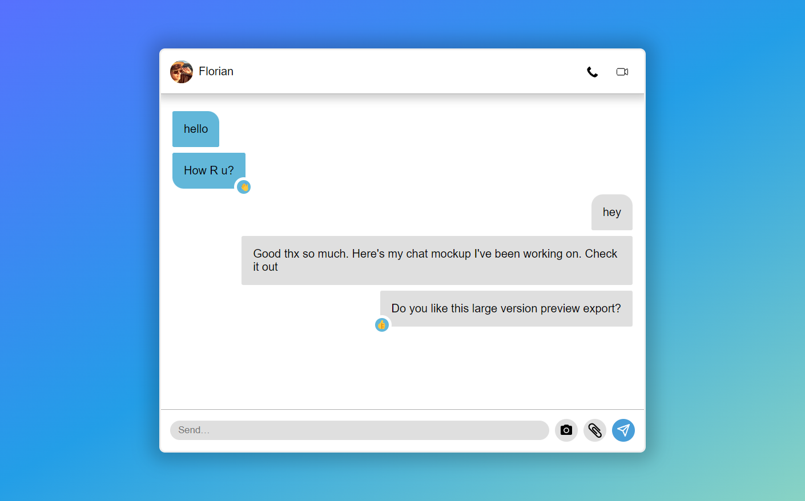
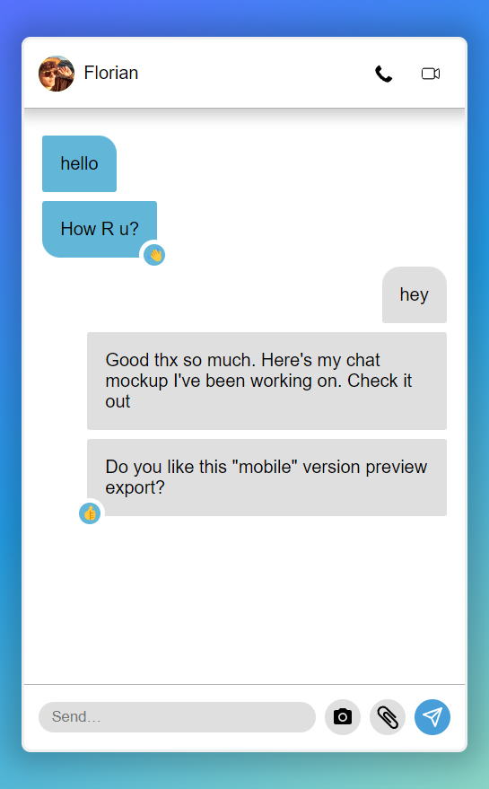

# Chat mockup
An HTML GUI that takes a JSON file in and generate a fake messenger app interface to create previews
Check this [codepen live demo](https://codepen.io/Florian-Cossu/pen/zYXbxXg)

| Large screen version             | Mobile screen version             |
| -------------------------------- | --------------------------------- |
|  |  |

## JSON Input data example
```
{
    "contact": "Florian",
    "pic_url": "https://infograflow.com/images/photo.jpg",
    "messages": {
        "0": {
            "in": [
                {
                    "message": "hello",
                    "emoji": null
                },
                {
                    "message": "How R u?",
                    "emoji": "👋"
                }
            ]
        },
        "1": {
            "out": [
                {
                    "message": "hey",
                    "emoji": null
                },
                {
                    "message": "Good thx so much. Here's my chat mockup I've been working on. Check it out",
                    "emoji": null
                },
                {
                    "message": "Do you like this large version preview export?",
                    "emoji": "👍"
                }
            ]
        }
    }
}
```